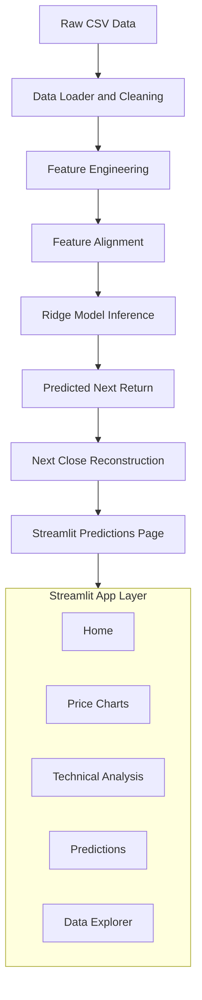

# BitVision: Bitcoin Forecasting Model

Live deployment: https://bitvision-iitj.streamlit.app/

BitVision is an end-to-end Bitcoin forecasting project that combines time-series feature engineering, model experimentation, and an interactive Streamlit dashboard for analysis and predictions.

## Problem Statement

Bitcoin prices are highly volatile and difficult to forecast directly from raw OHLCV data.  
This project addresses the problem by predicting the closing price of Bitcoin of the next day using OHLCV and other technical indicators. 


## Dataset

The repository currently includes:

- `data/bitcoin_price_Training.csv`
- `data/bitcoin_price_testing.csv`

### Raw Columns

The data uses market OHLCV structure:

- `Date`
- `Open`
- `High`
- `Low`
- `Close`
- `Volume`
- `Market Cap`

### Data Handling

- Dates are parsed and sorted chronologically.
- Numeric fields with commas are cleaned and converted to numeric types.
- Header normalization handles common variations (e.g., `date` -> `Date`).

Implementation details: `app/utils/data_loader.py`

## How We Solved It

### 1) Feature Engineering

Core features used in the final ridge workflow:

- `Return_1d` = `Close.pct_change(1)`
- `Return_3d` = `Close.pct_change(3)`
- `SMA_7_diff` = `(Close - SMA_7) / SMA_7`
- `Volatility_7` = rolling 7-day std of `Return_1d`

These are built from raw OHLCV and aligned to model expectations.

Implementation details: `app/utils/feature_engineering.py`, `notebooks/experiments/final_pipeline.ipynb`

### 2) Target Definition

- `Next_Return = Return_1d.shift(-1)`
- For dashboard evaluation in price terms:
  - `pred_next_close = current_close * (1 + pred_next_return)`
  - compared against `actual_next_close = Close.shift(-1)`

This keeps training mathematically stable (return target) while preserving intuitive output (price chart).

Implementation details: `app/pages/4_Predictions.py`

### 3) Inference Pipeline

- Load selected dataset (raw/processed with fallback logic).
- Build or recover required features.
- Align feature names to model artifact schema.
- Predict next return.
- Reconstruct next close.
- Render charts + metrics (`MAE`, `RMSE`, `MAPE`, `R2`).

Implementation details: `app/utils/inference.py`, `app/pages/4_Predictions.py`

## Models We Tried

Experiments were performed in notebooks across classical ML and deep learning approaches.

### Classical Models

- Gaussian Naive Bayes (direction classification)
- Decision Tree
- SVR (RBF)
- Gradient Boosting Regressor
- Ridge Regression (selected final model)

Notebook: `notebooks/experiments/classical_models.ipynb`

### Deep Learning Models

- MLP
- 1D-CNN
- LSTM
- GRU

Notebook: `notebooks/experiments/deep_learning_models.ipynb`

## Final Selected Model

- **Model:** Ridge Regression
- **Artifact:** `models/bitcoin_ridge_model.pkl`

References:

- `notebooks/experiments/final_pipeline.ipynb`
- `app/utils/inference.py`

## Architecture



## Project Structure

```text
BitVision/
├── app/
│   ├── Home.py
│   ├── components/
│   │   ├── charts.py
│   │   └── metrics.py
│   ├── pages/
│   │   ├── 1_Price_Charts.py
│   │   ├── 2_Technical_Analysis.py
│   │   ├── 4_Predictions.py
│   │   └── 5_Data_Explorer.py
│   └── utils/
│       ├── config.py
│       ├── data_loader.py
│       ├── feature_engineering.py
│       ├── inference.py
│       └── technical_indicators.py
├── data/
│   ├── bitcoin_price_Training.csv
│   └── bitcoin_price_testing.csv
├── models/
│   └── bitcoin_ridge_model.pkl
├── notebooks/
│   ├── eda.ipynb
│   ├── model_explainability.ipynb
│   └── experiments/
│       ├── classical_models.ipynb
│       ├── deep_learning_models.ipynb
│       └── final_pipeline.ipynb
├── requirements.txt
└── README.md
```

## Running the App

### 1) Install dependencies

```bash
pip install -r requirements.txt
```

### 2) Run Streamlit

```bash
streamlit run app/Home.py
```

### 3) Open in browser

Streamlit will print a local URL (usually `http://localhost:8501`).

## Dashboard Pages

- **Home**: market summary cards, sparkline, quick stats.
- **Price Charts**: candlestick/line view with overlays and date filters.
- **Technical Analysis**: RSI, MACD, Stochastic, ATR with parameter controls.
- **Predictions**: next-close forecasting from ridge-return predictions, timeframe filter, metrics.
- **Data Explorer**: quick training/testing table inspection.

## Limitations

- Current testing CSV is short; rolling features may require history context.
- Notebook experimentation is rich, but production training pipeline is notebook-driven (not yet a standalone reproducible script/module).

## Future Improvements

- Add reproducible training CLI/pipeline script with versioned artifacts.
- Add proper time-series backtesting protocol and trading-cost simulation.
- Add model registry metadata (training window, metrics, feature schema, artifact hash).
- Add unit tests for data loader, feature builder, and inference alignment.

## Team Members 

- Divyansh Yadav
- Akhil Dhyani
- Harshit
- Gaurang Goyal


